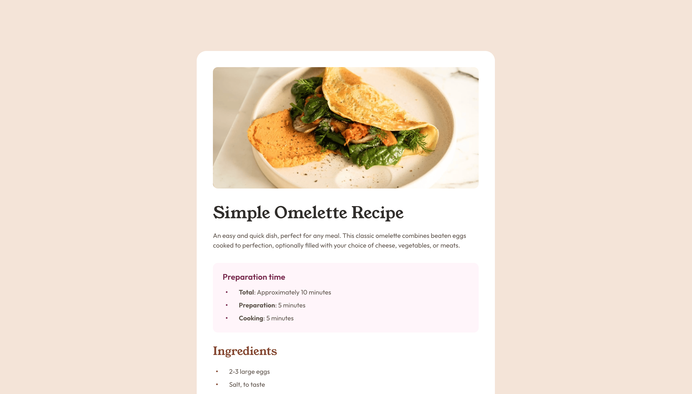

# Frontend Mentor - Recipe page solution

This is my solution to the [Recipe page](https://www.frontendmentor.io/challenges/recipe-page-KiTsR8QQKm) project.

## Screenshot

## Links

- [GitHub URL](https://github.com/ahong211/recipe-page)
- [Live Site URL](https://ahong211.github.io/recipe-page/)

## Built with

- Semantic HTML5
- CSS Nesting
- Flexbox
- Pseudo-elements
- Tables

## Author

- Frontend Mentor - [@ahong211](https://www.frontendmentor.io/profile/ahong211)
